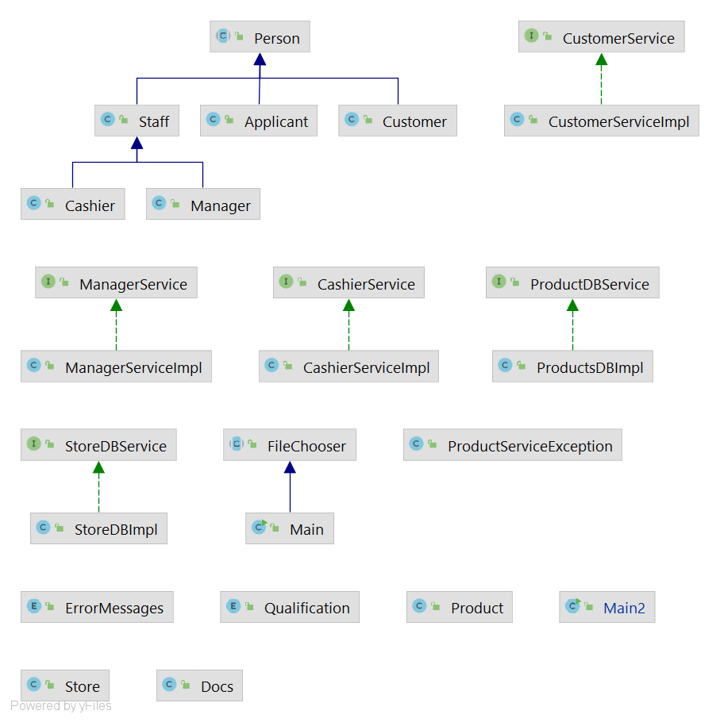
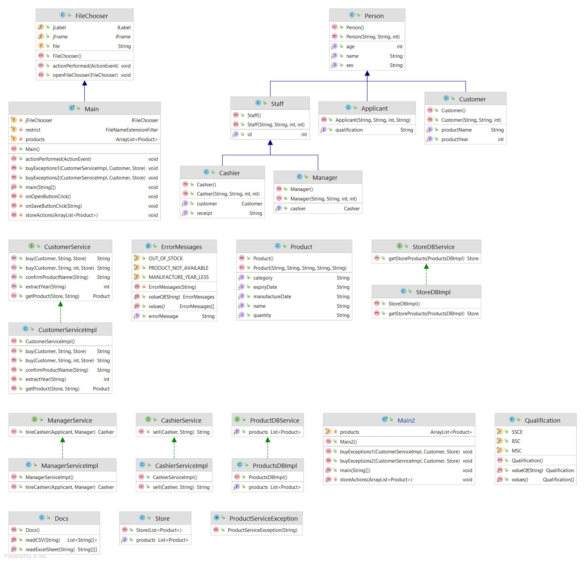
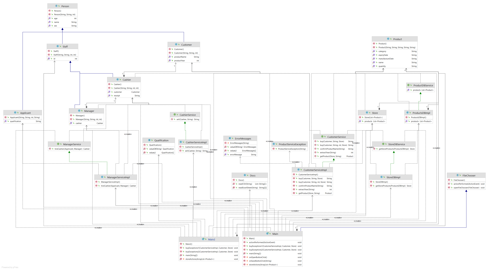

# week-two-sq012
Reading product data from an Excel sheet/CSV file and storing it as an array of product objects for a sample store. Products are categorized for easy access by the cashier and customers. Product out of stock are made as “OUT OF STOCK” to prevent the purchase of products that are not available.

